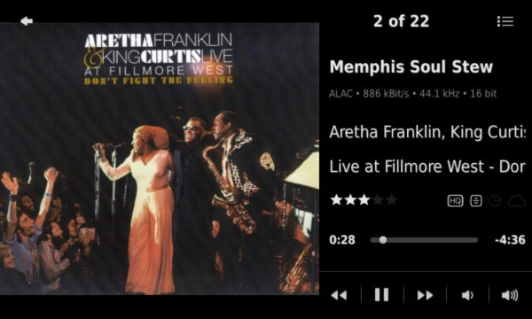

Ratings Light
====

A plugin[^1] that takes care of rating tracks in your [Logitech Media Server](https://github.com/Logitech/slimserver) library. 

#### LMS web ui view:

 
 
#### piCorePlayer - *Show more rated tracks by artist* view

 
 
#### Boom - ratings display, rating menu, *show more rated tracks by artist* view

 
 
#### *Rated Tracks* browse menus

 
 
#### *Rated Tracks* context menu
  
(available for artist, album, genre, year and playlist)
 
  
#### Ratings Light *Settings* pages

 

## Requirements

- LMS version >= 7.**9**
- LMS database = **SQLite**

 
<a href="https://github.com/AF-1/">⬅️ <b>Back to the list of all plugins</b></a>

   

## Features:

* **set** track ratings (supports **incremental** rating changes)
	* in your browser using the *default LMS* or the *Material* skin web UI
	* on your Logitech devices or piCorePlayer (context menu)
	* using the IR remote of your (Logitech) device
	* in supported apps and plugins

* **import** track ratings
	* batch rate all tracks in a playlist
	* using keywords in comments tags (auto-import after scan is possible)

* **export** rated tracks to playlist files (as a backup or to import ratings in other apps)
* **browse rated tracks by artist or genre**[^2] (with optional library view filter)
* *create* (scheduled) **backups** of your ratings and *restore* your ratings from backups
* keep track of your **recently rated songs** with a dedicated *playlist* or a plain text *log file*
* **show rated songs** for any *artist, album, genre, year* or *playlist* using the respective **context menu** (i.e. song details/**more** page if you're using the LMS *default* skin or *Material* skin)
* provides mixes for **Don't Stop The Music** plugin
* *display track ratings* in *LMS menus* (web UI and text) or on older devices using the *Now Playing screensaver* or the *Music Information Screen* plugin
* most features should work with **online library tracks** (see [**FAQ**](https://github.com/AF-1/lms-ratingslight#faq))

**Some features are not enabled by default.** Please go to the plugin's settings page to enable them.

[^1]: If you want localized strings in your language, read <a href="https://github.com/AF-1/sobras/wiki/Adding-localization-to-LMS-plugins"><b>this</b></a>.
[^2]: Browse menus are provided by LMS. Under certain circumstances you may see (empty) albums or artists in some menus that shouldn't be there. There's nothing I can do about it because LMS creates and provides these menus. Just go down one level: click to *show all tracks* or *show all albums*. In case this LMS issue ever gets resolved I'll update this page.

    

## Installation

You should be able to install *Ratings Light* from *LMS* > *Settings* > *Plugins*.

If you want to test a new patch that hasn't made it into a release version yet or you need to install a previous version, you'll have to [install the plugin manually](https://github.com/AF-1/sobras/wiki/Manual-installation-of-LMS-plugins).

*Previously released* versions are available here for a *limited* time after the release of a new version. The official LMS plugins page is updated about twice a day so it usually takes a couple of hours before new released versions are listed.
    

## Reporting a bug

If you think that you've found a bug, open an [**issue here on GitHub**](https://github.com/AF-1/lms-ratingslight/issues) and fill out the ***Bug report* issue template**. Please post bug reports on **GitHub only**.
    

## Rating character in title format (* or ★)

The default rating character for the title format **RL_RATING_STARS_APPENDED** (*settings > interface*) is the common **asterisk** (*) wrapped in parentheses. Some screenshots here show this title format with the *black star* rating character (★) (see *RL settings > menus*). 
If you want to display the **black star** character on *players with jivelite* as graphical frontend (*piCorePlayer, Touch, Radio, SqueezePlay...*), you have to install a font that includes the black star character. [**This page**](https://github.com/AF-1/sobras/tree/main/lms-jivelite-change-font) has more information.
    

## Display ratings on the Now Playing screen of piCorePlayer, Squeezebox Touch or Radio

If you've always wanted the **Now Playing** screen of your piCorePlayer, SB Touch, SB Radio or SqueezePlay to **display track ratings**, please read [**this**](https://github.com/AF-1/sobras/tree/main/lms-nowplaying_screen_with_ratings). Here's an example:

     

## FAQ

»<b>Does <i>Ratings Light</i> work with <i>online</i> tracks?</b>«
 
It should work with online tracks that have been <b>added to your LMS library as part of an album</b>. LMS does not import single online tracks or tracks of online playlists as library tracks and therefore they cannot be processed by Ratings Light. That's a restriction imposed by LMS.

 

»<b>Is <i>album</i> rating supported?</b>«
 
Short answer: no. <i>Album ratings</i> per se do not exist in LMS. So any displayed album rating would have to be calculated, i.e. the average track rating of all album tracks. Most people have only very few rated tracks in an album, and so you get 'meaningful' (average) album ratings like 0.23 or 0.35. 
Setting ratings for an entire album basically tells LMS to set the rating of <b>all</b> album tracks to some value - because there is no album rating other than the calculated one. That would mean: all album tracks would be rated equally - and even the best albums have weak tracks. 
So I'm not convinced that displaying and setting <i>album ratings</i> would be of any use at all. Therefore it's not supported. 
Instead I recommend you mark complete albums that you like very much as <i>LMS favourites</i> or add them to some static playlist.

 

»<b>How does <i>importing ratings from file tags</i> work?</b>«
 
<i>Ratings Light</i> does not scan files, it has no scanner module. LMS scans your music files and stores the data found in the file tags in the LMS database. 
<i>Importing rating values from file tags</i> with RL therefore means that RL reads the file tag values stored in the LMS database, converts them to rating values and saves them to the LMS persistent database. 
Unfortunately, there is no universal <i>rating tag</i> that is supported by <b<all</b> music file formats across different music players - and scanned/imported by LMS. So in order to import your ratings into LMS, you'll have to use/repurpose a file tag that you don't use otherwise and, more importantly, one that is <b>scanned and imported by LMS</b>.  
In <i>Ratings Light</i> you can choose between the <b>BPM</b> tag and the <b>comments</b> tag to import ratings values from.  
RL expects integer rating values on a 10-step rating scale from 0 to 100 in the <b>BPM</b> tag (corresponding to the internal LMS rating scale). → 0 or no value = unrated → 10 = 0.5 stars → 20 = 1 star ... → 100 = 5 stars  
If you want to use the <b>comments</b> tag, choose at least one short keyword to prefix the rating value. You can also choose a keyword suffix. RL supports importing integer rating values (no half-star ratings) on a scale from 1 to 5. 
<b>Example:</b> Rating keyword <b>pre</b>fix = "favstars", rating keyword <b>suffix</b> = "xx". If a comments tag contains "favstars<b>4</b>xx", RL will save the track rating value for <b>4</b> stars.

 

»<b>Where does Ratings Light store track ratings?</b>«
 
<i>Ratings Light</i> does not use its own database. It tells LMS to store the track ratings in the <b>LMS</b> <i>persistent</i> database which is not cleared on rescans. However, if you value your ratings very much, I'd recommend to enable <i>scheduled</i> backups in RL. Or at least create occasional <i>manual</i> backups.

 

»<b>How do I migrate ratings from <i>TrackStat</i> to <i>Ratings Light</i>?</b>«
 
You don't have to. Since ratings are stored in an LMS database (see FAQ above), you just <b>un</b>install <i>TrackStat</i> and install <i>Ratings Light</i>. TrackStat had its own database table (with identical columns though) but <i>ratings</i> should be in sync.

 

»<b>Can Ratings Light sync track ratings to <i>music streaming providers</i> or other <i>online services</i>?</b>«
 
Short answer: no. Many music streaming providers and online services now use a binary scheme (e.g. called <i>like</i> or <i>heart</i>) to "rate" tracks, albums or artists. But even if some still supported a 5-star rating scale, I simply would not have the time to keep RL compatible with possible (API) changes of all those different services in the long run. If you wanted to reduce star track ratings to binary likes or hearts and sync them to a specific online service, this should be done by the LMS plugin for this specific online services.

 

»<b>Can I use a <i>10-star</i> rating scale?</b>«
 
If apps still support rating stars, they usually have a 5-star rating scale - also a good idea for LMS because it makes for a consistent user experience. For example, the Material web skin has a 5-star rating scale. There won't be a 10-star rating scale display option in RL. If you really need the extra rating steps, you can enable half-star ratings in the RL settings as a workaround.

 

»<b>Can I use CLI commands to set ratings?</b>«
 

Explained in the <a href="https://github.com/AF-1/lms-ratingslight/wiki/CLI-commands">wiki</a>.

 

»<b>Can I use <i>Ratings Light</i> together with <i>TrackStat</i>?</b>«
 
I think you can although I'm not sure it's a good idea, not only because of the UI clutter (you'll have 2 rating menu items in many places). Some apps or plugins that support track rating (like Material skin) will check for TrackStat first (it's been around longer) and if enabled use TrackStat for rating tracks. But then <i>Ratings Light</i> can't know about track rating changes and features like the <i>Recently Rated</i> playlist or the rating log file won't work. There may be other issues. So you can but I don't recommend it.

 

»<b>Does <i>Ratings Light</i> work with <i>iPeng</i>?</b>«
 
Displaying and changing track ratings in iPeng is already possible via the <b>context menu</b>. iPeng <b>additionally</b> offers the possibility to display and change track ratings directly in the <b>top left menu bar</b>. Unfortunately iPeng supports this officially only for the now discontinued TrackStat plugin because <i>Ratings Light</i> was first released <u>after</u> the (currently) last iPeng update. However, you'll find a workaround in the <i>Menus</i> section of the RL settings that should allow you to display and change track ratings directly in iPeng's top left menu bar (requires an LMS restart).

 

»<b>How is the <i>Recently Rated playlist</i> different from the <i>Recently Rated log</i> file?</b>«
 

In general, whenever you change a track's rating <b>with Ratings Light</b> (web interface, jivelite, CLI...) the track is added to the playlist and/or the log file if you've enabled this in the settings. Both are meant to help you keep track of your rating actions, i.e. the tracks whose rating you've changed. 

The <b>recently rated playlist</b> keeps a record of all tracks with changed ratings <b>but</b>
- it will <b>not add tracks twice</b>. Example: Set a track's rating to 4 stars, then set it to 2 stars. The track will only show up only once in the playlist with the <b>latest</b> rating (2 stars), <b>no matter how often</b> you have changed its rating.
- <b>Un</b>rating a track (rating = 0) will not delete this track from the playlist because unrating is a rating change too. 

If you want to keep detailed track of your rating actions and don't need a playable list, I suggest you use the <b>log file</b>.

 
  

I'd like to thank *mherger* for his invaluable support and *erland* for his plugins, a great source of inspiration.
