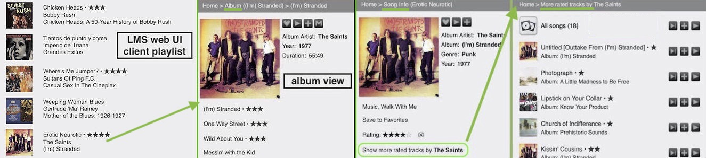
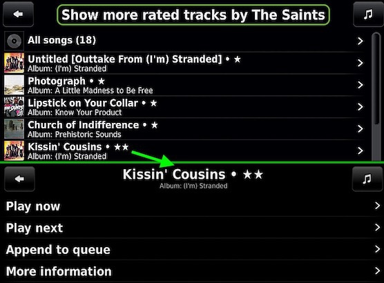
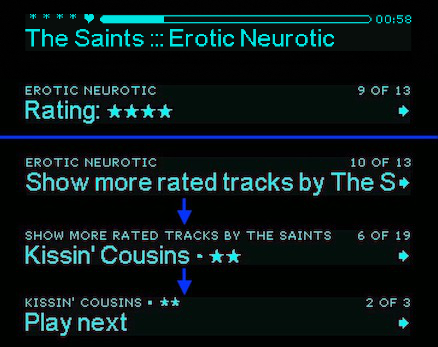
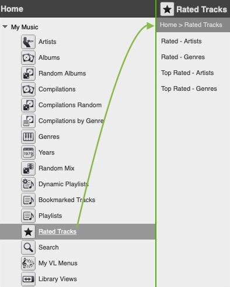
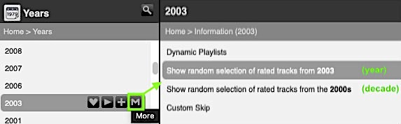
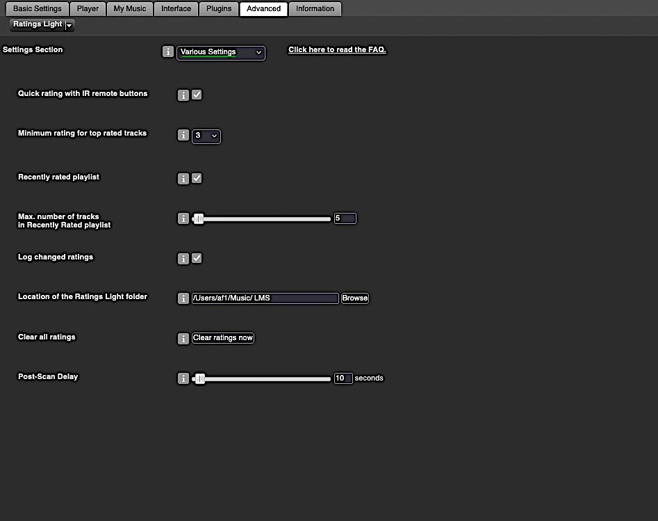
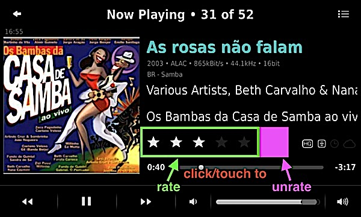
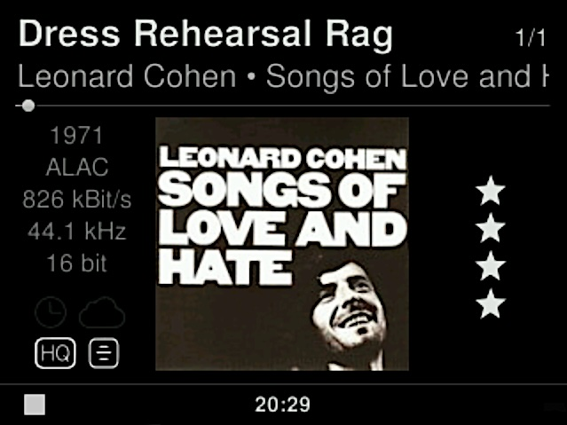

Ratings Light
====

**Ratings Light**[^1] takes care of rating tracks in your LMS library. See [**features**](#features) section for details.
  
<a href="https://github.com/AF-1/">⬅️ <b>Back to the list of all plugins</b></a>
  
**Use the** &nbsp;  &nbsp;**icon** (top right) to **jump directly to a specific section.**

  

## Screenshots[^3]

#### LMS web ui view:

   
#### piCorePlayer - *Show more rated tracks by artist* view

   
#### Boom - ratings display, rating menu, *show more rated tracks by artist* view

   
#### *Rated Tracks* browse menus

   
#### *Rated Tracks* context menu
  
(available for artist, album, genre, year and playlist)
    
#### Ratings Light *Settings* pages

   

## Features

* **set** track ratings
	* in your browser using web skins like *(Dark) Default* or *Material*
	* on your Logitech devices or piCorePlayer (context menu)
	* using the IR remote of your (Logitech) device
	* in supported apps and plugins
	* supports **incremental** rating changes

* **import** track ratings
	* batch rate all tracks in a playlist
	* from file tags
	   * using keywords in *comments* tags (auto-import after scan is possible)
	   * using the *BPM* tag
	   * auto-import after a (re)scan is possible

* **export** rated tracks to playlist files (as a backup or to import ratings in other apps)
* create **virtual libraries for (top) rated tacks** with *browse menus*[^2]
* *create* (scheduled) **backups** of your ratings and *restore* your ratings from backups
* keep track of your **recently rated songs** with a dedicated *playlist* or a plain text *log file*
* **show rated songs** for any *artist, album, genre, year* or *playlist* from the **context menu**
* includes mixes for the **Don't Stop The Music** plugin
* *display track ratings* in *LMS menus* (web UI and text) or on older devices using the *Now Playing screensaver* or the *Music Information Screen* plugin
* most features should work with **online library tracks** (see [FAQ](#faq))

Some features are not enabled by default.

    

## Requirements

- LMS version >= 8.**2**
- LMS database = **SQLite**

 
<a href="https://github.com/AF-1/">⬅️ <b>Back to the list of all plugins</b></a>

   

## Installation

*Ratings Light* is available from the LMS plugin library: **LMS > Settings > Manage Plugins**. 

If you want to test a new patch that hasn't made it into a release version yet, you'll have to [install the plugin manually](https://github.com/AF-1/sobras/wiki/Manual-installation-of-LMS-plugins).
    

## Report a new issue

To report a new issue please file a GitHub [**issue report**](https://github.com/AF-1/lms-ratingslight/issues/new/choose).
   

## ⭐ Contributing

If you find this plugin useful, please consider giving it a  on GitHub (top right of this page) so that other users can discover it (in their News Feed).
    

## Rating character in title format (* or ★)

The default rating character for the title format **RL_RATING_STARS_APPENDED** (*settings > interface*) is the common **asterisk** (*) wrapped in parentheses. Some screenshots here show this title format with the *black star* rating character (★) (see *RL settings > menus*). 
If you want to display the **black star** character on *players with jivelite* as graphical frontend (*piCorePlayer, Touch, Radio, SqueezePlay...*), you have to install a font that includes the black star character. [**This page**](https://github.com/AF-1/sobras/tree/main/lms-jivelite-change-font) has more information.
    

## Display ratings on the Now Playing screen of piCorePlayer, Squeezebox Touch or Radio

You can install an [**applet**](https://github.com/AF-1#applets) on your *piCorePlayer*, *SB Touch*, *SB Radio* or *SqueezePlay* to **display track ratings** on the **Now Playing** screen. Examples:

#### pCP, Touch, SqueezePlay

  

#### SB Radio

     

## FAQ

»<b>What rating scale does this plugin use?</b>« &nbsp;&nbsp;&nbsp;&nbsp;»<b>Can I use / disable <i>half-star</i> ratings?</b>«
 
Rating values are stored in the <i>tracks_persistent</i> database table provided by LMS. <b>Internal rating values in LMS</b> can range <b>from 0 (no stars) to 100 (5 stars) where 20 equals 1 star</b> (40 = 2 stars, 50 = 2.5 stars etc.). So how rating values are stored in LMS is a default that cannot be changed.  <i>Ratings Light</i> will <i>always</i> <b><u>display</u> the exact half-star value</b> on a <b>5</b>-star rating scale (e.g. LMS track rating value of 50 is displayed as 2.5 stars). You can enable or disable <b><i>setting</i> half-star ratings</b> on this page: <i>LMS settings</i> > <i>Advanced</i> > <i>Ratings Lights</i> > <i>Menus</i>. If, for some reason, you have tracks with odd track rating values (e.g. 67), <i>Ratings Light</i> will round them to the nearest half-star rating - <i>for display</i> only, the actual rating values remain unchanged.

 

»<b>Is <i>album</i> rating supported?</b>«
 
<i>“Album ratings“</i> as such do not exist in LMS, only <b>track</b> ratings. You can <b>set</b> a rating for all or only the unrated tracks in an album using the <b>album context menu</b>. Setting ratings for single album tracks in this menu is possible with the Default, Dark Default and Classic web skin.  RL does <b>not display</b> “album ratings“, i.e. the average track rating of all album tracks. Most albums would probably have a very low average track rating (displayed as zero stars) and you'd have to display the “album rating“ in the album context menu. If you want albums sorted by (average) rating, take a look at the <a href="https://github.com/AF-1/#-context-stats"><b>Context Stats</b></a> plugin.

 

»<b>I have ratings <i>display</i> issues (ratings not displayed, wrong rating values…)</b>«
 
<i>Ratings Light</i> is only responsible for displaying ratings in 2 places (see <a href="https://github.com/AF-1/lms-ratingslight#lms-web-ui-view">screenshot</a>): in the track context / song info menu and via the <i>title format</i> if you use e.g. "RL_RATING_STARS_APPENDED". So while <i>Ratings Light</i> is always used to <i>set</i> ratings, plugins, skins or apps usually ask LMS <i>directly</i> for the rating value. RL is not involved. That's why RL plays, for example, no role in displaying rating values in Material Skin's playlist queue or track / album lists.  
You can always see the actual rating value for a track in the LMS database by going to the context / song info menu of the track and looking for the <i>Rating</i> tag. It shows the rating value in the LMS scale from 0 to 100 where 20 = 1 star. You'll have to reload this menu after changing the rating value to see the new rating value.  
Possible causes of problems: 

   - You have duplicate tracks/albums (e.g different audio formats) and your files have the same MusicBrainz ID tags. LMS often tries to match tracks on MusicBrainz IDs first. 

  - Your audio files have RATING tags that LMS may use to display ratings. 

  - You used TrackStat before switching to Ratings Light. But then you (briefly) reinstalled TrackStat (don't!). TS might have reset the ratings that you've set with RL in the meantime.

In short, <i>Ratings Light</i> has usually <i>nothing</i> to do with <i>displaying</i> ratings, except for the track context / song info menu and the title format.

 

»<b>Does <i>Ratings Light</i> work with <i>online</i> tracks?</b>«
 
It should work with online tracks that have been <b>added to your LMS library as part of an album</b>. LMS does not import single online tracks or tracks of online playlists as library tracks and therefore they cannot be processed by Ratings Light. That's a restriction imposed by LMS.

 

»<b>How do I make <i>Ratings Light</i> display track rating in album view, client playlists etc.?</b>«
 
On the <i>LMS Settings</i> > <i>Interface</i> page, you'll find that <i>Ratings Light</i> provides 2 <b>title formats</b>:  <b>RL_RATING_STARS</b> and <b>RL_RATING_STARS_APPENDED</b>.  You can create a new title format, e.g. “<b>TITLE RL_RATING_STARS_APPENDED</b>“ that will display the track title followed by the track rating value in stars.  In <i>LMS Settings</i> > <i>Advanced</i> > <i>Ratings Light</i> > <i>Menus</i> you can <b>choose the displayed rating character for menus and titel formats</b>: a <b>common text star</b> or the <b>unicode 2605 blackstar</b> character.  
<b>Please note:</b> <i>SB Touch, SB Radio, piCorePlayer, Squeezeplay and other players running jivelite</i> do not support displaying the unicode blackstar character out of the box. This character is not part of their default font. If you want to display this character on these devices you'll have to replace the default font on these devices with a font that contains this character. 
More information, instructions, and fonts <a href="https://github.com/AF-1/sobras/tree/main/lms-jivelite-change-font">here</a>. The <b>Material</b> web skin uses its own way to display track ratings in menus and playlists.

 

»<b>I have <i>renamed / moved</i> some audio files. How can I preserve my ratings for these tracks?</b>«
 

You can use backups. Go to the plugin's settings page (backup section) immediately before you rescan your library and confirm that <i>Backup before each library rescan</i> is <b>en</b>abled. Just to be safe on the safe side, create a manual backup as well. Then rescan your library. With the rescan completed, go to the plugin's settings page and restore the rating values from the pre-scan backup. RL will try to restore the ratings for moved/renamed tracks using (relative) path guessing and MusicBrainz IDs. Of course, there's no guarantee that it will restore 100% but that's as good as it gets.

 

»<b>Where does Ratings Light store track ratings?</b>«
 
<i>Ratings Light</i> does not use its own database. It tells LMS to store the track ratings in the <b>LMS</b> <i>persistent</i> database which is not cleared on rescans. However, if you value your ratings very much, I'd recommend to enable <i>scheduled</i> backups in RL. Or at least create occasional <i>manual</i> backups.

 

»<b>Which <i>buttons</i> on the IR <i>remote</i> control should I use for <i>rating</i>?</b>« &nbsp;&nbsp;&nbsp;&nbsp;»<b>Which devices are supported?</b>«
 

To enable IR remote rating: 

   - <b>SB Classic, Boom, Transporter</b>, other VFD devices: 

      - rating is handled on the server side. 

      - enable the <b>Quick rating with IR remote buttons</b> setting on the plugin's settings page and restart the server. 

   - <b>SB Touch</b>: 

      - IR remote rating is handled by an <b>applet <i>on</i></b> the device. The plugin setting <i>Quick rating with IR remote buttons</i> has <b>no effect</b>. 

      - Install an applet that enables and handles remote rating like the <a href="https://github.com/AF-1/jivelite-darkflatskin?#dark-flat-skin"><b>Dark Flat Skin</b></a> applet.

Rate the track currently playing on your device by <b>holding down</b> a button on the IR remote. Press and <b>hold</b> the key until you see the new track rating on your display or a message confirming the new track rating.  <b>Key map</b>: 

   - keys 1 to 5 = 1 to 5 stars 
   - 0 = unrate 
   - 6 = subtract 1 star from current rating 
   - 7 = add 1 star to current rating 
   - 8 = subtract 0.5 stars from current rating 
   - 9 = add 0.5 stars to current rating

The keys are the same for all supported devices except for the 
<b>Boom (mini remote)</b>: 

   - arrow up = add 1 star to current rating 
   - arrow down = subtract 1 star from current rating

 

»<b>Does <i>Ratings Light</i> auto-rate tracks when I play or skip them?</b>«
 
No. Please use the <a href="https://github.com/AF-1/#-alternative-play-count"><b>Alternative Play Count</b></a> plugin for that. It can auto-rate tracks and offers you an alternative, the <b>dynamic played/skipped value</b> that reflects your <b>recent</b> listening habits/decisions but does not mess with your tracking ratings.

 

»<b>How do I migrate ratings from <i>TrackStat</i> to <i>Ratings Light</i>?</b>«
 
You don't have to. Since ratings are stored in an LMS database (see FAQ above), you just <b>un</b>install <i>TrackStat</i> and install <i>Ratings Light</i>. TrackStat had its own database table (with identical columns though) but <i>ratings</i> should be in sync. You can even import ratings for <i>local</i> tracks from old TrackStat backup files.

 

»<b>How does <i>importing ratings from file tags</i> work?</b>«
 
<i>Ratings Light</i> does <b>not scan files</b>, it has no scanner module. LMS scans your music files and stores the data found in the file tags in the <b>LMS</b> database. RL does <b>not</b> create or use its own database table. 
<i>Importing rating values from file tags</i> with RL therefore means that RL reads the file tag values stored in the LMS database, converts them to rating values and saves them to the LMS persistent database. It does <b>not scan</b> your files.  
If you have tracks with <b>dedicated rating tags</b> which are not supported and imported by LMS, you can use the <a href="https://github.com/AF-1/#-custom-tag-importer"><i>Custom Tag Importer</i></a> plugin to scan these tags and set LMS track ratings accordingly.  
Unfortunately, there is no universal <i>rating tag</i> that is supported by <b<all</b> music file formats across different music players - and scanned/imported by LMS. So if you can't use <i>Custom Tag Importer</i> to import your ratings into LMS, you'll have to use/repurpose a file tag that you don't use otherwise and, more importantly, one that is <b>scanned and imported by LMS</b>.  
In <i>Ratings Light</i> you can choose between the <b>BPM</b> tag and the <b>comments</b> tag to import ratings values from.  
RL expects integer rating values on a 10-step rating scale from 0 to 100 in the <b>BPM</b> tag (corresponding to the internal LMS rating scale). → 0 or no value = unrated → 10 = 0.5 stars → 20 = 1 star ... → 100 = 5 stars  
If you want to use the <b>comments</b> tag, choose at least one short keyword to prefix the rating value. You can also choose a keyword suffix. RL expects integer rating values (<b>no half-star ratings</b>) on a scale from 1 to 5 for importing from comments tags. 
<b>Example:</b> Rating keyword <b>pre</b>fix = "favstars", rating keyword <b>suffix</b> = "xx". If a comments tag contains "favstars<b>4</b>xx", RL will save the track rating value for <b>4</b> stars.

 

»<b>When I create a backup, RL <i>does not write a backup file</i>.</b>« &nbsp;&nbsp;&nbsp;&nbsp;»<b>When I <i>export rated tracks to playlist files</i>, RL does not write any playlist files.</b>«
 

The <i>RatingsLight</i> folder is where RL stores its backup files and playlist files. On every LMS (re)start, RL checks if there's a folder called <i>RatingsLight</i> in the parent folder. The default <b>parent</b> folder is the <i>LMS preferences folder</i> but you can change that in RL's preferences. If it doesn't find the folder <i>RatingsLight</i> inside the specified parent folder, it will try to create it.  
The most likely cause is that RL can't create the folder because LMS doesn't have read/write permissions for the parent folder (or the <i>RatingsLight</i> folder). You'll probably find matching error messages in the server log.  
So please make sure that <b>LMS has read/write permissions (755) for the <i>parent</i> folder - and the <i>RatingsLight</i> folder</b> (if it exists but cannot be accessed).

 

»<b>Can Ratings Light sync track ratings to <i>music streaming providers</i> or other <i>online services</i>?</b>«
 
Short answer: no. Many music streaming providers and online services now use a binary scheme (e.g. called <i>like</i> or <i>heart</i>) to "rate" tracks, albums or artists. But even if some still supported a 5-star rating scale, I simply would not have the time to keep RL compatible with possible (API) changes of all those different services in the long run. If you wanted to reduce star track ratings to binary likes or hearts and sync them to a specific online service, this should be done by the LMS plugin for this specific online services.

 

»<b>Can I use CLI commands to set ratings?</b>«
 

Explained in the <a href="https://github.com/AF-1/lms-ratingslight/wiki/CLI-commands">wiki</a>.

 

»<b>Can I use <i>Ratings Light</i> together with <i>TrackStat</i>?</b>«
 
You really shouldn't. If you rate tracks with <i>Ratings Light</i>, these rating changes will be lost the next time you restart your server because TrackStat will reset the LMS database ratings to the TrackStat database values.

 

»<b>Does <i>Ratings Light</i> work with <i>iPeng</i>?</b>«
 
Displaying and changing track ratings in iPeng is already possible via the <b>context menu</b>. iPeng <b>additionally</b> offers the possibility to display and change track ratings directly in the <b>top left menu bar</b>. iPeng has no official support for <i>Ratings Light</i> yet. However, you'll find a workaround in the <i>Menus</i> section of the RL settings that should allow you to display and change track ratings directly in iPeng's top left menu bar (requires an LMS restart).

 

»<b>How is the <i>Recently Rated playlist</i> different from the <i>Recently Rated log</i> file?</b>«
 

In general, whenever you change a track's rating <b>with Ratings Light</b> (web interface, jivelite, CLI...) the track is added to the playlist and/or the log file if you've enabled this in the settings. Both are meant to help you keep track of your rating actions, i.e. the tracks whose rating you've changed. 

The <b>recently rated playlist</b> keeps a record of all tracks with changed ratings <b>but</b>
- it will <b>not add tracks twice</b>. Example: Set a track's rating to 4 stars, then set it to 2 stars. The track will only show up only once in the playlist with the <b>latest</b> rating (2 stars), <b>no matter how often</b> you have changed its rating.
- <b>Un</b>rating a track (rating = 0) will not delete this track from the playlist because unrating is a rating change too. 

If you want to keep detailed track of your rating actions and don't need a playable list, I suggest you use the <b>log file</b>.

 
   

[^1]: If you want localized strings in your language, please read <a href="https://github.com/AF-1/sobras/wiki/Adding-localization-to-LMS-plugins"><b>this</b></a>.
[^2]: Browse menus are provided by LMS. Under certain circumstances you may see (empty) albums or artists in some menus that shouldn't be there. There's nothing I can do about it because LMS creates and provides these menus. Just go down one level: click to *show all tracks* or *show all albums*. In case this LMS issue ever gets resolved, I'll update this page.
[^3]: The screenshots might not correspond to the UI of the latest release in every detail.

